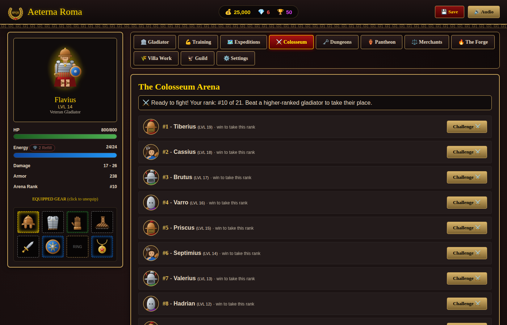

# Czapo presents, a steaming bowl of "It should probably maybe work?". It's a single player "clone" of Gladiatus, the browser game. It's in a proof of concept stage and the code is indeed written with the help of an AI agent.
# Aeterna Roma - Hero of Rome

An offline, single-player ancient Roman RPG written in Python. The game runs entirely on your computer in its own window: no web server, no background process, no open network ports.




## Features

- **Dynamic Level Scaling**: Colosseum Arena ladder opponents and Expedition/Dungeon monsters scale their stats, HP, damage, and rewards to match the player's level.
- **11 Interactive Tabs**:
  - Overview / Character Sheet: attributes, inventory with gear comparison, hidden combat stats, a Chronicle of lifetime statistics, gear sets, a Bestiary of every foe you have slain, and 23 Laurels (achievements) that pay rubies
  - Attribute Training
  - Expeditions: 12 regions, from the Suburbs of Rome and the Port of Ostia to Britannia, the Parthian Steppe, the Gates of Avernus and the Slopes of Olympus
  - Colosseum Arena: 21-place ranking ladder, titles, ruby rewards for reaching the top 5, 3 and 1, a 5-minute cooldown between bouts, and an Honor exchange (bigger satchel, the Emperor's Favor, Murmillo set pieces, rubies)
  - Dungeons: 6 multi-floor dungeons, down to the Depths of Tartarus, whose bosses guard Mythic treasures; replayable after you conquer them
  - Pantheon: 3 divine tasks at a time (win expeditions, hunt a specific monster, win arena bouts, clear dungeon floors) for gold, XP and rubies, plus a Temple where a gold offering buys a blessing of Mars, Minerva, Juno, Mercury or Apollo for the next few fights
  - Roman Forum Merchants (Weaponsmith, Armorer, General Merchant, Apothecary): they buy your items back for half their value
  - The Forge: smelting, 16 crafting recipes, and gear enhancement up to +5
  - Patrician Villa Work: timed shifts that pay out even while the game is closed
  - Gladiator Guild: a shared gold vault plus Training Grounds, Library, and Villa buildings with real bonuses
  - Game Settings: theme, combat report speed, renaming, and save import/export
- **Gear with character**: dozens of named weapons and armor (pila, spathae, lorica squamata, ...), prefixes and suffixes (e.g. *Titan* or *of Mars*) that add attribute bonuses, and rarity that makes them stronger.
- **6 gear sets**: wear 2 or more pieces of the Legionary's Panoply, Murmillo of Capua, Regalia of the Pharaoh, Vulcan's Forgework, Mercury's Swiftness or Tidecaller's Raiment for bonuses such as +armor, +damage, +crit or +gold.
- **Mythic treasures**: each dungeon boss guards a unique item with special powers (life steal, bonus damage, HP regeneration, ...), guaranteed on your first conquest.
- **Balanced progression**: monster strength, the XP curve and rewards were tuned with a built-in simulator (`python -m aeterna.balance`) so every region is winnable when it unlocks and stays worthwhile as you level.
- **Rubies**: earned from dungeon bosses (mostly on the first conquest), Pantheon tasks, and arena milestones. Spend them to refill energy, skip the arena cooldown, or bring in new merchant wares.
- **Animated combat reports**: fights play out line by line with live HP bars (Instant, Fast, or Normal speed).
- **Hand-drawn vector art**: icons for every kind of gear, portraits for all 52 monsters and the 4 gladiator styles, scene banners for every region and dungeon, and a player figure that changes with the gear you equip.
- **5 Custom Visual Themes**: Dark Imperial, Roman Parchment, Colosseum Crimson, Legion Emerald, and Tyrian Purple.

## Playing

You need **Python 3.9 or newer** (from [python.org](https://www.python.org/downloads/)).

```cmd
python -m pip install -r requirements.txt
python aeterna_roma.py
```

On Windows you can also double-click `run.bat`, which installs the one dependency the first time and starts the game.

The window is drawn by [pywebview](https://pywebview.flowrl.com/), which uses the web view already built into your system. The interface is loaded straight into the window, so no local web server is involved.

- **Windows 10/11**: works out of the box (uses Microsoft Edge WebView2). On older or stripped-down systems, install the [WebView2 Runtime](https://developer.microsoft.com/microsoft-edge/webview2/) if the window stays blank.
- **macOS**: works out of the box (uses WebKit).
- **Linux**: needs a GTK or Qt web view, for example `sudo apt install python3-gi gir1.2-webkit2-4.1` on Ubuntu/Debian, or `python -m pip install "pywebview[qt]"`.

To check that everything is in place without opening a window, run `python aeterna_roma.py --check`.

### Building a standalone `AeternaRoma.exe`

Run `build.bat` on Windows. It installs PyInstaller and packs Python, the game and its interface into a single `dist\AeternaRoma.exe` that runs without Python installed.

## Saving

- Progress is saved automatically after every action to `save.json` in your user folder:
  - Windows: `%APPDATA%\AeternaRoma`
  - macOS: `~/Library/Application Support/AeternaRoma`
  - Linux: `~/.local/share/aeterna-roma`

  The exact path is shown under **Settings**. Set the `AETERNA_ROMA_DATA_DIR` environment variable to keep it somewhere else.
- Saves are written to a temporary file and then swapped in, so a crash can't leave a half-written save. If a save ever can't be read, it is kept as `save.corrupt-<time>.json` and a new game starts.
- Only one copy of the game can run at a time, so two windows can't overwrite each other's progress.
- **Settings → Export / Import Save File** backs up your gladiator or moves it to another computer.
- **Coming from an older version?**
  - *Browser version* (`game.html`): its progress lived in the browser's storage, which the Python version can't read. Open that version one last time, use **Settings → Export Save File**, then **Import Save File** here. If you no longer have it, download `game.html` from commit [`4df4255`](https://github.com/czapencjusz/aeterna-roma/blob/4df4255/game.html).
  - *Original C# version*: import its `savegame.json` (it sits next to the old `AeternaRoma.exe`).

## Project layout

```
aeterna_roma.py        Launcher: opens the game window (python aeterna_roma.py --check tests a build without a window)
aeterna/
  data.py              Game content and tuning numbers (monsters, regions, recipes, sets, blessings, ...)
  items.py             Item generation, names, prices, save-file cleanup for items
  rules.py             Gladiator stat formulas and guild bonuses
  combat.py            Combat formulas and the fight loop
  state.py             New games, Pantheon quests, loading any save format
  engine.py            The Game class: every player action and the timers
  balance.py           Balance simulator: python -m aeterna.balance
  view.py              Builds the numbers the interface draws
  storage.py           Save files, save location, single-instance lock
  api.py               Bridge between the window and the game
  ui/index.html        The interface: layout, styles, SVG art, and a thin script that draws what Python sends
tests/
  test_game.py         Rule tests:       python -m unittest discover -s tests
  e2e/ui_test.js       Interface test (needs Node.js + Playwright):   node tests/e2e/ui_test.js
```

All game rules live in Python. The page never changes the game itself: it shows what Python sends back and passes your clicks to Python.

## Running the tests

```cmd
python -m unittest discover -s tests
```

This runs the rule tests (combat, items, quests, guild, saving and loading every save format). They need nothing beyond Python.

The interface test loads the real page in Chromium and sends every click to the Python game. It needs [Node.js](https://nodejs.org/) and Playwright:

```cmd
npm install playwright
npx playwright install chromium
node tests/e2e/ui_test.js
```
