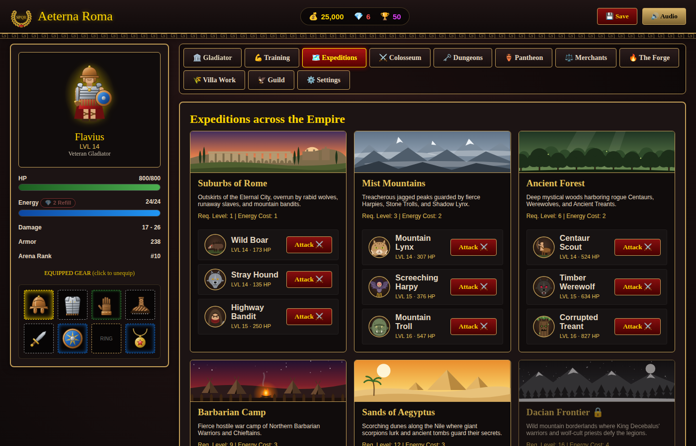

# Czapo presents, a steaming bowl of "It should probably maybe work?". It's a single player "clone" of Gladiatus, the browser game. It's in a proof of concept stage and the code is indeed written with the help of an AI agent.
# Aeterna Roma - Hero of Rome

An offline, single-player ancient Roman RPG that runs entirely on your computer. The whole game is one self-contained web page (`game.html`): no server, no background process, no open network ports.

## Features

- **Dynamic Level Scaling**: Colosseum Arena ladder opponents and Expedition/Dungeon monsters scale their stats, HP, damage, and rewards to match the player's level.
- **11 Interactive Tabs**:
  - Overview / Character Sheet: attributes, inventory with gear comparison, hidden combat stats, and a Chronicle of lifetime statistics
  - Attribute Training
  - Expeditions: 6 regions, from the Suburbs of Rome to the Dacian Frontier
  - Colosseum Arena: 21-place ranking ladder, titles, ruby rewards for reaching the top 5, 3 and 1, and a 5-minute cooldown between bouts
  - Dungeons: 3 multi-floor dungeons with bosses, replayable after you conquer them
  - Pantheon: 3 divine tasks at a time (win expeditions, hunt a specific monster, win arena bouts, clear dungeon floors) for gold, XP and rubies
  - Roman Forum Merchants (Weaponsmith, Armorer, General Merchant, Apothecary): they buy your items back for half their value
  - The Forge: smelting, 10 crafting recipes, and gear enhancement up to +5
  - Patrician Villa Work: timed shifts that pay out even while the game is closed
  - Gladiator Guild: a shared gold vault plus Training Grounds, Library, and Villa buildings with real bonuses
  - Game Settings: theme, combat report speed, renaming, and save import/export
- **Gear with character**: item prefixes and suffixes (e.g. *Titan* or *of Mars*) add attribute bonuses, and rarity makes them stronger.
- **Rubies**: earned from dungeon bosses (mostly on the first conquest), Pantheon tasks, and arena milestones. Spend them to refill energy, skip the arena cooldown, or bring in new merchant wares.
- **Animated combat reports**: fights play out line by line with live HP bars (Instant, Fast, or Normal speed).
- **5 Custom Visual Themes**: Dark Imperial, Roman Parchment, Colosseum Crimson, Legion Emerald, and Tyrian Purple.
- **Hand-drawn vector art**: icons for every kind of gear (each matches the item's name), portraits for all 25 monsters and the 4 gladiator styles, scene banners for every region and dungeon, and a player figure that changes with the gear you equip. All the art is drawn as SVG code inside `game.html`, so there are still no image files to ship.



## Playing

**Without building anything:** double-click `game.html` to open it in your browser (Edge, Chrome, or Firefox).

**As a Windows app:** run `build.bat` from Command Prompt or PowerShell to compile `AeternaRoma.exe`, then double-click it.

```cmd
build.bat
```

`AeternaRoma.exe` is only a small launcher. `game.html` is embedded inside it. The launcher unpacks the page to `%LOCALAPPDATA%\AeternaRoma\game.html`, opens it in a chromeless Edge (or Chrome) app window, and exits straight away. If neither browser is found, it opens the page in your default browser.

## Saving

- Progress is saved automatically in the browser's local storage after every action.
- Saves belong to the browser that ran the game. The launcher always opens the page from the same location, so your save carries over between launches.
- Use **Settings → Export Save File** to back up your gladiator or move it to another computer, and **Import Save File** to load it again. Save files from the old server version (`savegame.json`) can be imported too.
- If a save can't be read, it is kept as a backup copy in local storage, and a new game starts in its place.
